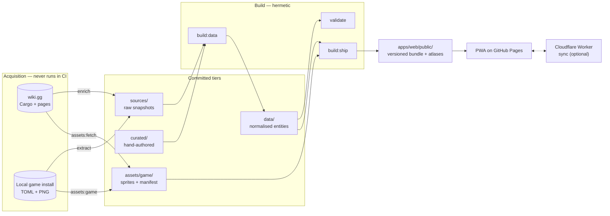
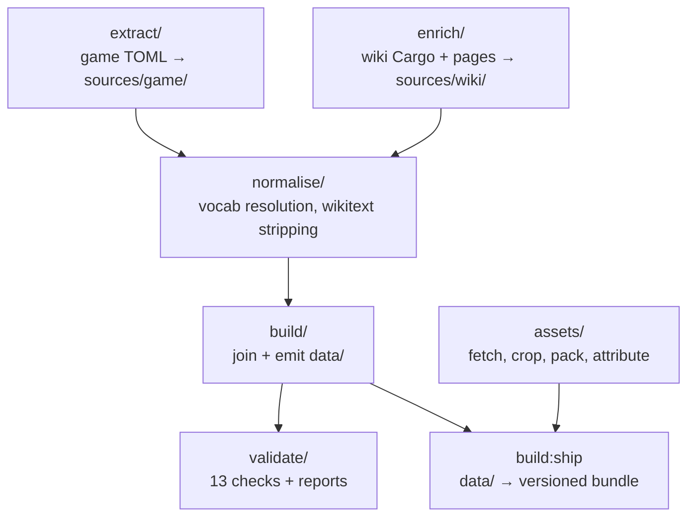
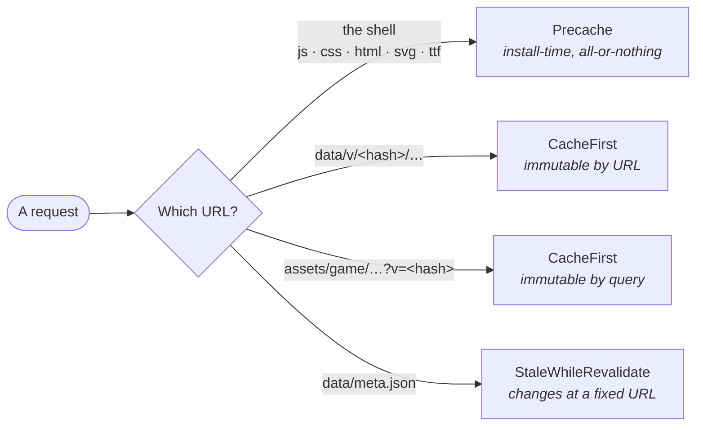
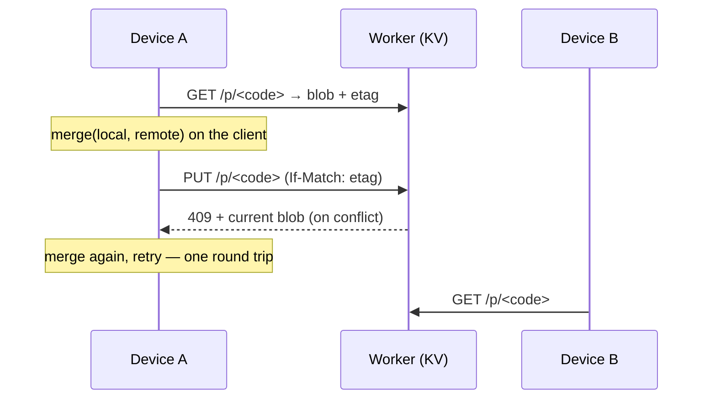

# Architecture

How Mistria Codex is put together, and why each piece is the shape it is.

This describes the system **as built**. [PLAN.md](PLAN.md) describes what was
intended, and the two have diverged in ways worth knowing — see
[What was planned and dropped](#what-was-planned-and-dropped). For the rules you
must not break, read [../CLAUDE.md](../CLAUDE.md) and
[../apps/web/CLAUDE.md](../apps/web/CLAUDE.md); this document explains the
structure those rules protect.

---

## 1. The whole thing in one page

Mistria Codex is an unofficial companion app for *Fields of Mistria*: a
game-data reference you can use on a phone, offline, while playing. It answers
"what can I go and find right now", "what does the museum still need", "where do
I get this", and "who wants this as a gift".



The one-sentence version: **a build-time ETL pipeline compiles two messy
sources into a small, strongly-typed, content-addressed dataset, and a static
offline-first React app queries it with integer arithmetic.**

Everything below is a consequence of that sentence.

---

## 2. The constraints that produced the design

Four constraints did most of the architectural work. None is a preference.

**There is no server.** No accounts, no login, no database, no API. Progress
lives on the device. The only backend is an optional 199-line Cloudflare Worker
that stores one opaque blob per device code. This removes an entire universe of
concerns (auth, sessions, migrations, PII, uptime) and imposes one: **every
answer must be computable on the client from files it already has.**

**The host is GitHub Pages.** Pages sends fixed response headers and has no
rewrite rules. Two consequences run through the whole system:

- Cache policy cannot live in HTTP, so **versions live in URLs** (`data/v/<hash>/…`)
  and **the service worker owns caching**.
- A request for a path that is not a file 404s, so **routing is hash-based** and
  every URL is built from `import.meta.env.BASE_URL`. A leading `/` works in dev
  and breaks in production — this is the single most repeated warning in the
  repo.

**The data is not ours.** The game's text and art belong to NPC Studio; the
wiki's prose is CC BY-SA. The project redistributes **facts** (numbers, ids,
relationships) and, under attribution, **sprites confined to one directory**. See
[DATA-POLICY.md](DATA-POLICY.md). Architecturally this produces: a prose-key
denylist in the writer, a licensing validator, a single art directory with a
manifest, and a generated `ATTRIBUTION.md`. `git rm -r assets/game && pnpm build:ship`
is the complete takedown procedure, and any change that makes that untrue is a bug.

**The sources are unreliable and disagree.** The wiki is community-maintained
and partly stale; the game files are authoritative but cryptic. So the pipeline
never guesses: an unrecognised token is recorded in `build/unresolved.json`, a
missing value is `null` plus a `data_gaps[]` entry, and a disagreement between
sources is **reported, never auto-corrected** — currently 2,020 facts compared
and 26 apart.

---

## 3. Workspace layout

A pnpm workspace, Node 22, TypeScript strict throughout.

```
packages/schema/       @mistria/schema   —  2,159 lines, 17 files
packages/pipeline/     @mistria/pipeline — 22,612 lines, 106 files
packages/sync-client/  @mistria/sync-client — 226 lines
apps/web/              @mistria/web      — 12,832 lines, 65 files (+1,638 e2e)
workers/sync/          @mistria/sync-worker — 199 lines

sources/  curated/  data/  assets/game/   the four committed data tiers
docs/     plans, policy, generated reports (gitignored)
```

**The monorepo is not about build orchestration** — there is no Turbo or Nx, and
`tsc -b` project references are the only cross-package machinery. It exists for
two concrete reasons:

1. `workers/sync` needs Cloudflare's type environment and `apps/web` needs the
   DOM lib. Those fight in one tsconfig.
2. `sync-client`'s device-code parsing genuinely must be identical in the app
   and the Worker. Two implementations of a checksum are two implementations
   that eventually disagree, and the failure is somebody's valid code rejected —
   or an invalid one accepted.

Type-checking is a composite build: `tsconfig.json` references schema →
sync-client → pipeline → web. `strict` plus `noUncheckedIndexedAccess`,
`exactOptionalPropertyTypes`, `noUnusedLocals` and `verbatimModuleSyntax`.

---

## 4. Tech stack

### Shared

| Choice | Version | Why this one |
|---|---|---|
| **pnpm workspaces** | 10.11 | Strict node_modules; no phantom dependencies across packages |
| **TypeScript** | 5.8, strict | `exactOptionalPropertyTypes` matters here: the dataset distinguishes *absent*, *null* and *empty*, and a loose tsconfig lets that distinction rot |
| **Zod** | 4 | One schema is the runtime validator, the static type, **and** the emitted JSON Schema (`z.toJSONSchema()`). Three artefacts that cannot drift |
| **Biome** | 2.5 | Lint + format in one pass, fast enough to run on every commit. 100-col, 2-space, single quotes |
| **Vitest** | 3 | 450 tests, 30 files, one runner across every package |
| **tsx** | 4 | Pipeline scripts run straight from TypeScript. No build step for a tool nobody ships |

### Pipeline

| Choice | Why |
|---|---|
| **smol-toml** | The game ships TOML. Small, correct, no native bindings |
| **pngjs** | Atlas packing is a *pixel copy, not a resize* — pixel art must never be resampled. Pure JS keeps output byte-identical across machines, where a native encoder's bytes depend on the platform's libvips |
| **Ajv 8** | An independent second validator over the emitted JSON Schema. Zod validating data produced by Zod-typed code can agree with itself; Ajv cannot |
| **consola** | Readable CLI output for a dozen scripts |

### Web app

| Choice | Why |
|---|---|
| **Vite 7** | Static output, no server framework |
| **React 19** | — |
| **TanStack Router** | Chosen for `validateSearch`: the flagship screen's entire state is `?season&day&year&weather&time`, typed and Zod-validated on the way in, including from someone else's pasted link. Hash history, because Pages has no rewrites |
| **Tailwind v4** | CSS-first config. Every colour is a CSS variable in `tokens.css`, which the SVG maps read too — one palette, two rendering systems |
| **Dexie 4** | IndexedDB for progress. One flat table keyed `domain:entityId` |
| **vite-plugin-pwa** (`injectManifest`) | The caching rules are specific enough — versioned-immutable, art-lazy, meta-revalidated — that a generated worker would have to be fought rather than configured |
| **lucide-react** | UI glyphs, distinct from game sprites |
| **playwright-core** | E2E against a real production build. `-core` reuses a Chromium the machine already has rather than adding a browser download to every install |

### Worker

Plain `export default { fetch }` on `workers/sync`, deployed with wrangler, KV
for storage and Cloudflare's rate-limit binding. No framework — see
[§9](#9-sync).

---

## 5. The data pipeline

Five stages, each a directory in `packages/pipeline/src/`.



### The three tiers, and why there are three

| Directory | Written by | Committed | Never |
|---|---|---|---|
| `sources/` | `extract` / `enrich:*` | yes | hand-edited |
| `curated/` | humans | yes | generated |
| `data/` | `build:data` | yes | hand-edited |
| `apps/web/public/data/` | `build:ship` | **no** | — |

The original design had a single `data/` directory that was "hand-maintained and
generated". That is the one arrangement guaranteeing a regeneration silently
eats someone's hand edits. Splitting inputs from outputs makes the invariant
statable:

> **`data/` is a pure deterministic function of `sources/ + curated/`.**

CI enforces it by regenerating and running `git diff --exit-code`. That check is
the only thing that makes a committed, generated directory trustworthy, and it
is why `writeJson()` sorts keys recursively — without byte-stable output the
diff is noise and the check gets disabled.

**`sources/` is committed so CI never touches the wiki.** Builds are hermetic
and fast, nobody needs to own the game to build the project, and wiki.gg is not
hammered on every push. It is also why `extract`, `enrich:*`, `assets:fetch` and
`assets:game` are marked *never in CI* — they need credentials, a game install,
or politeness.

### `extract/` — the game's own files

`pnpm extract` reads an owned game install (`MISTRIA_GAME_DIR`, from a gitignored
`.env`) and writes eight JSON snapshots. Nothing writes *into* the game folder,
and no localisation string comes out of it. See
[game-file-extraction.md](game-file-extraction.md).

This is where the dataset's authority comes from. The game states things the
wiki cannot: exact spawn rules, internal item ids, recipe ingredients as ids
rather than wikitext, shop prices, quest item requirements.

### `enrich/` — the wiki

`pnpm enrich:cargo` pulls nine Cargo tables via `Special:CargoExport` (the
`api.php` route throws `MWException`; fields must be table-qualified).
`pnpm enrich:pages` parses thirteen wiki pages the Cargo tables do not cover —
schedules, museum sets, cosmetics prices, map marker pages.

`lib/http.ts` is the only network module: a disk cache so a parser bug does not
mean re-downloading thousands of pages, a shared throttle (module-level, so a
sprite download and a page read take turns rather than each politely waiting
while the other hammers), eight retries backing off to two minutes, and
`Retry-After` honoured. A zero-row response **throws** — "empty response
overwrites good data" is the classic failure here.

### `normalise/` — loose text into controlled vocabulary

`resolve.ts` maps wiki tokens onto enums using `curated/vocab/*.json`.
`wikitext.ts` strips markup and decodes entities.

The governing rule: **an unrecognised token is recorded, never guessed.**
Everything unresolved lands in `build/unresolved.json` with suggestions, which
is the curation to-do list (`pnpm data:unresolved`). Under `--strict` an
unresolved token fails the build. *The build failing on an unrecognised token is
the design working.*

### `build/` — the join

`build/data.ts` orchestrates 18 builder modules in a **declared dependency order**, not
alphabetically: museum sets first so each item can carry its set id, shops next
so each item can carry who sells it, items third, mine biomes last because a
biome reads the fish already located in it rather than keeping a second copy.

Three pieces of shared machinery:

- **`context.ts`** loads every source and curated file once and hands builders a
  `BuildContext`. `ctx.idFor(displayName)` is the only sanctioned way to compute
  an item id — the index lives behind that one function so an id that changes
  changes everywhere at once.
- **`item-ids.ts`** replaces slug guesses with the game's real internal names.
  192 of 999 differed from the naive slug (Copper Ore is `ore_copper`, a Chicken
  Egg is `egg`), and nothing about that divergence is detectable from the wiki.
  Every id that moves keeps its old value in `former_ids[]`, which makes a
  rename a migration rather than data loss.
- **`game-facts.ts`** is the curated view of the extracted game data — what the
  builders are allowed to see of `sources/game/`.

### `build:ship` — the runtime bundle

Compiles `data/` into what the app actually fetches:

- 29 files under `data/v/<dataVersion>/` — the 24 registered datasets plus five
  derived shapes: `index.json` (the display index), `availability.json` (the
  flat rules index), `request_board.json`, `items_furniture.json` (925 records
  the page for an apple never needs), and `id_migrations.json`.
- `meta.json` at a **stable** URL, naming the version directory. The one file
  whose content changes at a fixed path, and therefore the one file that must
  not be cached hard.
- Packed sprite atlases and `ATTRIBUTION.md`.

`dataVersion` is content-addressed, so a rebuild with no data change produces
the same version: no service-worker churn, no spurious re-download.

### `build:seo` — the crawlable surface

The app is invisible to search, for two compounding reasons that no amount of
metadata fixes:

1. **Hash routing collapses every screen to one URL.** Crawlers strip
   fragments, so `#/item/ore_copper` and `#/museum` are both
   `/mistria-codex/`. Google's `#!` scheme was deprecated in 2015 and removed.
2. **AI crawlers do not execute JavaScript.** GPTBot, ClaudeBot and
   PerplexityBot fetch raw HTML and stop; one measurement had ClaudeBot
   downloading JS on 23.8% of requests and running it on none. Googlebot is
   the only major crawler that renders. So an AI crawler sees
   `<div id="root"></div>` and nothing else.

The answer is a second surface rather than a rebuilt first one: `build/seo/`
emits **1,396 static HTML pages plus 177 moved-id stubs** into
`apps/web/public/guide/`, generated from the same `data/`, needing no runtime.
`sitemap.xml`, `robots.txt` and `llms.txt` land beside them.

| Decision | Why |
|---|---|
| One directory, wiped and rewritten each run | `rm -rf guide/` removes the feature entirely — the `assets/game/` discipline applied to a second generated tree. Also means a renamed record cannot strand a stale page. |
| `render.ts` owns all markup; `pages.ts` returns data | Escaping lives in one function instead of fourteen builders. |
| Furniture, cosmetics and 221 factless rows excluded | 1,285 near-duplicate pages ("Basic Wood Chest" ×15) is the thin-content pattern, and it drags the pages worth reading down with it. |
| Nothing `spoiler` or `unreleased` is published | The app veils these; publishing them hands the reveal to Google. `validate/seo.ts` fails the build on it. |
| No `lastmod` in the sitemap | The only available timestamp is `builtAt`, which moves every deploy. An always-"now" lastmod is worse than none. |
| Text only, no game art | Keeps pages light and the takedown story unchanged. `og:image` is the one exception and is omitted when no art is packed. |

**The trap it had to avoid** is worth stating because it would have been
silent: `injectManifest.globPatterns` includes `**/*.html`, and Vite copies
`public/` into `dist/` verbatim, so all 1,573 pages would have entered the
Workbox precache — which is all-or-nothing, meaning one 404 among them stops
the service worker installing and takes offline mode with it. `'**/guide/**'`
in `globIgnores` prevents it and CI asserts the precache holds zero `guide/`
entries.

`robots.txt` is emitted but **does nothing today**: crawlers read it only at
the domain root, which on `user.github.io` belongs to the user-page repository.
It becomes correct the day a custom domain is attached. `llms.txt` is
speculative — Google's June 2026 documentation says Search ignores it, and
Ahrefs found 97% of valid files received zero bot requests in a month — so it
ships as a free option and nothing depends on it.

### `assets/` — the art path

`fetch.ts` pulls wiki-hosted sprites; `game-art.ts` copies the ones the wiki has
no file for from an owned install (furniture, notably — the `FurnitureTEMP`
table has no art column at all). `crop.ts` cuts animation strips into frames
using each sprite's own `.meta.toml` rather than a hardcoded frame count.
`pack.ts` packs 2,602 files into 8 sheets plus 28 whole-file portraits, capped
at 2040px because 2048 is the smallest maximum texture size still found on
low-end mobile GPUs — a sheet wider than that is not a slow image, it is a blank
one.

Everything is registered in `assets/game/manifest.json`, checked **both
directions** by the licensing validator: a file with no entry is art that
entered without provenance, and an entry with no file is a register that lies.

---

## 6. The contract layer — `@mistria/schema`

Small (2,159 lines) and load-bearing. Three things live here.

### The registry

`registry.ts` declares all 24 datasets — file path, Zod schema, key field,
description. The JSON Schema emitter, the validator and the ship step all
iterate it, so **a new entity type is added in exactly one place and cannot be
half-registered.**

### The envelope

Every record carries `id`, `name`, `numeric_id` (+ its game version),
`id_status`, `former_ids[]`, `also_known_as[]`, `spoiler_aliases[]`, `confidence`,
`data_gaps[]` and per-field `prov`.

Two of those exist purely to survive the future and are **not retrofittable**:

- **`former_ids[]`** — when ids get rewritten, users' saved progress orphans
  without it.
- **`prov`** — per-field provenance, because a single `source` string becomes a
  lie the moment enrichment happens. A fish's sell value comes from the game
  files, its museum set from the wiki, its locations from hand curation.

### The availability model — the spine

The single most important shape in the project.

> **Availability is an array of windows. Each window is an AND of its
> constraints; the array is an OR.**

A bug can be spring-in-town-at-night *and* all-season-in-the-mines-any-time. A
flat `{seasons, weather, time}` cannot express that, and collapsing two windows
into one silently produces wrong answers on the flagship screen.

Four rules follow, and each keeps a special case out of the client:

| Rule | Consequence |
|---|---|
| **Unknown does not exclude** | A window with no recorded time matches every time. Excluding on unknown would empty the main screen rather than narrow it |
| **`null` means two different things** | *Not applicable* (mines have no weather) is `weather: null` + `weather_precision: "not_applicable"`. *Unknown* is `data_gaps: ["weather"]`. Conflating them makes the app confidently wrong |
| **Seasons and weather are fully expanded arrays** | Never an `"all"` magic string. Query code becomes a set intersection with zero special cases |
| **An inference never renders as a fact** | Habitat expansion ("Pond" → three ponds) sets `confidence: "inferred"` and the UI draws it hedged |

Midnight-wrapping windows (`20:00–02:00`, the night bugs — the game day ends at
02:00) are **split at build time in the flat index**, so runtime code never
contains `if (start > end)`. That is the highest-density bug area in the whole
project. `items.json` is a documented exception: ten of its ranges still wrap, so
clock strings there are safe to *render* and never safe to *compare*.

---

## 7. The runtime — `apps/web`

```
src/
  app/        AppShell, and the three providers: Atlas, ServiceWorker, Tour
  components/ shared pieces; DayDial is the signature element
  lib/        pure helpers; instant.ts owns the URL contract
  routes/     one file per screen (15)
  styles/     tokens.css, app.css, fonts.css
  sw.ts       the service worker
```

### Data loading

`lib/data.ts` fetches `meta.json` (`no-store`, deduped) to learn the version
directory, then loads datasets **one at a time, on demand**. `items.json` alone
is 1.4MB and parsing it on the main thread freezes a mid-range phone with no
spinner, because React cannot paint either — so a screen asks for what it needs
and nothing else.

It also carries a **self-heal**: the site can redeploy while a session is open,
and only the new version directory exists on the server. A 404 under the
versioned path re-reads `meta.json` past every cache (`?fresh=`), adopts the
newer manifest, and retries. Anything that is not a 404 is rethrown untouched —
retrying offline just doubles every failure.

### The query engine

`lib/findable.ts` answers the flagship question. The shipped
`availability.json` is **one flat rule per (entity, window, location)** with
every string already an integer:

- seasons and weather as **bitmasks**, so a match is an AND rather than a set
  intersection over string arrays;
- time ranges pre-split at midnight;
- a window with no location becomes one rule with no location, not zero rules —
  dropping it would hide most of the forageables.

Matching is a **linear scan** over 1,459 rules, and that is the intended design
rather than a placeholder: 1,459 rules times six integer comparisons is
microseconds, fits in cache, and has none of the bug surface of an interval
tree. A property test cross-checks it against a naive re-implementation across
1,000 random instants.

### State

There is no state library. State lives in exactly three places, chosen by
lifetime:

| Where | What | Why there |
|---|---|---|
| **URL search params** | The instant (`?season&day&year&weather&time`) | It is the entire state of the flagship screen, so an answer is shareable and survives a reload. Zod-coerced, because params arrive as strings from a pasted link and numbers from the router |
| **IndexedDB** (Dexie) | Progress — museum donations, hand-ins | Survives everything; syncable |
| **localStorage** | Preferences — text size, sort, spoilers, display mode | Changes the presentation of the same rows, not the answer. Two identical answers should not be two different links |

### Search

No search library. Every searchable field is a **name** — 2,925 of them, in an
index already downloaded for other screens — and a substring scan over them is
sub-millisecond. MiniSearch was planned and dropped: it is the right shape for a
corpus with prose in it, and this project deliberately holds none.

### Sprites

`assets/game/atlas.json` maps `icon_key` → sheet + rectangle. `<ItemIcon>` asks
for a sprite and handles `null`, because **a missing sprite is normal, not an
error**: 32 records have no art anywhere, and a clone that never ran
`pnpm assets:fetch` has none at all. Scaling is integer-only — pixel art at 1.5×
renders visibly lopsided and `image-rendering: pixelated` does not rescue it.

Every art URL carries `?v=${meta.assets.version}`. That is not decoration: the
service worker holds the whole art directory CacheFirst, which is only sound
while every URL under it is content-addressed — and the sheets are, but
`atlas.json`, the portraits and the brand icons are not.

### Caching — four tiers



The split is load-bearing. Workbox's `precacheAndRoute` fails the **entire**
install if one entry 404s, so tier one is only what Vite emitted and therefore
knows exists. The data bundle and the two megabytes of sprites are cached on
first use instead. The difference is between "offline works" and "the app never
installs".

`meta.json` is stale-while-revalidate because it is the one file whose content
changes at a fixed URL. Everything it points at is content-addressed and cached
forever.

**The worker never `skipWaiting()`s on its own** — reloading someone mid-museum-audit
is hostile. A new worker waits, a toast offers, and Settings can ask for a check
against the same registration. That check does two things, because they fail
independently: `registration.update()` catches a new shell, and a fresh
`meta.json` comparison catches a data-or-art-only redeploy, which leaves `sw.js`
byte-identical and would otherwise never prompt.

---

## 8. Progress and the CRDT

Progress is one flat Dexie table, not a table per feature — museum donations,
bugs caught, recipes learned all key as `domain:entityId`. That makes sync a
single generic merge and means a new category needs no migration.

**Every fact is `id -> ±epochSeconds`, and that one decision is what makes it a
CRDT.** Positive is done, negative is an explicit tombstone, and merging is
"larger absolute value wins, positive breaks a tie":

```
merge(a, b) = merge(b, a)              commutative
merge(merge(a,b),c) = merge(a,merge(b,c))   associative
merge(a, a) = a                        idempotent
```

Two devices ticking different things converge to the union; unchecking
propagates instead of being resurrected by the next sync. The tie-break must be
deterministic or the merge is not commutative — two devices would settle on
different answers depending on which merged first, and the set would oscillate
forever.

Unchecking writes a **tombstone, never a deletion**. A deleted row is
indistinguishable from a row this device has not seen, so the next sync would
treat the other device's "done" as newer and silently re-check it.

---

## 9. Sync

Optional, off by default, and deliberately minimal.



**The merge is not in the Worker.** Running it on the client keeps the Worker's
CPU trivially inside its limit, puts the CRDT in one property-tested place
instead of two, and means a bug in it is fixed by shipping the app rather than
redeploying a server. The endpoint is storage with an etag.

The free tier allows **1,000 KV writes a day**, and that number shaped the
design: the client generates its own code (handing one out costs no write), sync
is debounced, and a `PUT` that would store identical bytes is answered without
writing. A 409 returns the current blob so the client merges and retries in one
round trip rather than two.

Security is stated rather than implied. There are no accounts, so **the code
*is* the credential** — anyone holding it can read and change that progress. The
app says so in as many words next to the code. CORS is an explicit allowlist,
never `*`, because the endpoint accepts writes and a wildcard would let any page
someone visits alter their progress in the background.

`VITE_SYNC_URL` is **build-time only**. A sync endpoint someone can type into a
settings box is an endpoint an attacker can talk them into typing, and the app's
whole claim is that nothing leaves the device unless you ask. Unset,
`syncConfigured()` is false and the panel says so — it never renders a button
that cannot work.

---

## 10. Validation and CI

### `pnpm validate` — fourteen checks

| Check | Catches |
|---|---|
| `checkZod` | Records that do not match their schema |
| `checkAjv` | The same, via an *independent* implementation over the emitted JSON Schema |
| `checkDuplicateKeys` | Two records claiming one id |
| `checkReferentialIntegrity` | A foreign key pointing at nothing |
| `checkOrphans` | A record nothing references |
| `checkMuseum` | Set membership consistency |
| `checkGates` | Requirement tokens naming real quests, perks, skills |
| `checkGameAgreement` | Ids absent from the game's `ItemId` enum |
| `checkSourceAgreement` | Wiki vs game files — **reported, never auto-corrected** |
| `checkLicensing` | Prose keys, long strings, stray images, manifest parity, pasted wikitext |
| `checkSpoilers` | Spoiler flags against the curated rules |
| `checkSeo` | Guide slug collisions, a spoiler reaching a public URL, a broken internal link |
| `coverageFindings` | Fields below their expected fill rate |
| `assetCoverageFindings` | Records whose `icon_key` resolves to no sprite |

Errors fail; warnings do not. Coverage gaps are the normal state of a project
ingesting one category at a time, and a build that fails on them is a build
everyone learns to ignore.

It also *writes* reports — `coverage.md`, `id-divergence.md`,
`source-agreement.md`, `asset-coverage.md` — so drift is visible as a number
rather than discovered later.

### Two workflows

**`ci.yml`** runs three jobs. `check` is Biome + tsc + Vitest. `data` emits the
JSON Schema fresh (a stale one means Ajv is validating yesterday's contract),
rebuilds `data/`, asserts `git diff --exit-code`, and validates. `bundle` runs
`build:ship`, asserts `ATTRIBUTION.md` matches the manifest, and builds the app
**against the real base path** — because that is where a leading-slash URL stops
working, so a broken production path fails a PR rather than a deploy.

**`pages.yml`** ships the bundle, builds with `BASE_PATH`, writes a 404.html SPA
fallback and `.nojekyll`, and — usefully — *verifies the Pages source is
"GitHub Actions"*. Left on "Deploy from a branch" it serves a Jekyll render of
the README and races the real deploy, both green. The workflow cannot fix that
itself (it needs administration permission `GITHUB_TOKEN` can never hold), so it
detects and fails loudly instead of deploying an artifact nobody will see.

### `pnpm e2e` — the local gate, never CI

Eleven Playwright specs against a real production build in four layers:

- **`sweep`** opens every static route and a sample of every category, with ids
  drawn from the shipped index so it covers whatever the dataset grew. It fails
  on anything that *looks* broken with no feature attached: a console error, a
  404, a raw `snake_case` token, an `undefined`, an empty page. ~600 assertions.
- **`smoke`, `journeys`, `mobile`, `tour`, `stale-version`** walk named features
  and multi-screen intentions — a museum tick showing on the item page and back,
  a filter surviving the back button, a setting outliving a reload, a session
  healing a stale data version.
- **`icons`, `sort`, `item`, `depth`** assert things the app *derives* rather
  than prints — a sprite really rendering, a list ordering by what its own tags
  say, a weather note, a shop gate, a mine's floor range. These exist because
  every one of them fails as **absence**, which looks like ordinary data.
- **`crawl`** runs the whole context with `javaScriptEnabled: false` — the
  closest a browser gets to being GPTBot — and asserts a guide page carries its
  facts, its canonical, its structured data and its attribution in the raw
  response. Its negative control is the load-bearing half: the app shell, same
  browser and same settings, must render an *empty* `#root`. Either assertion
  alone proves nothing; the pair is what shows the static page is doing the
  work.

Two standing rules: a conditional assertion is not an assertion (assert the
precondition too), and every positive case is paired with the negative one that
proves the test rather than the rendering.

---

## 11. The invariants

If you change one thing in this system, make sure it is not one of these.

1. **`data/` is a pure deterministic function of `sources/ + curated/`.** Enforced
   by CI regeneration + diff.
2. **Internal snake_case names are the only keys.** Numeric ids are enum ordinals
   assigned at compile time — inserting one item shifts every id after it.
3. **Never invent a value.** `null` plus a `data_gaps[]` entry is correct; a
   plausible guess is a bug that propagates and becomes unfindable.
4. **Availability is OR-of-ANDs**, and unknown does not exclude.
5. **Game art lives in `assets/game/` and nowhere else**, only if manifested, and
   `data/` never references it — so deleting `assets/` orphans nothing.
6. **No in-game text, no wiki prose, no paraphrase of either.**
7. **No leading `/` in any URL.**
8. **No hardcoded colour.** Every one comes from `tokens.css`, because the accent
   *is* the current season.
9. **No internal token renders raw.** `lib/labels.ts` is the single translator.
10. **Never `skipWaiting` a service worker automatically.**

---

## 12. What was planned and dropped

[PLAN.md §Architecture](PLAN.md) names a stack that is now partly fiction. The
divergences are all deletions, and each is worth knowing:

| Planned | Status | Why |
|---|---|---|
| MiniSearch | **dropped** | Right for a prose corpus; this one is 2,925 names. A substring scan is sub-millisecond and needs no index to keep in step |
| Zustand | **dropped** | State turned out to belong in the URL, IndexedDB or localStorage. Nothing was left for a store |
| Radix primitives | **dropped** | Native elements plus `.tap-target` covered every control built |
| Hono (Worker) | **dropped** | One route. A plain `fetch` handler is 199 lines and no dependency |
| `@use-gesture/react` | **dropped** | The map's pan/zoom is raw pointer events on an SVG transform |
| `@tanstack/react-virtual` | **dropped** | Lists preview 8 rows and expand on request, which reads better than a virtualised wall |
| fast-check | **dropped** | The property tests are hand-rolled loops over generated instants |
| Node 24 | **is 22** | `.nvmrc` and `engines` both say 22 |

Two things went the other way: the game-file extraction path and the
game-install art path were both larger than planned and are now the dataset's
main source of authority.

---

## 13. Known architectural gaps

Stated plainly rather than discovered later.

- **`workers/sync` is outside the type project.** It has no `tsconfig.json` and is
  not in the root references, so `tsc -b` never checks it, and it references
  `KVNamespace` without `@cloudflare/workers-types` as a dependency. It is
  deployed and working, but it is the one package with no type gate.
- **CLAUDE.md calls the Worker "not started".** It is written and deployed;
  that line is stale.
- **CLAUDE.md claims a weekly refresh cron.** No such workflow exists — only
  `ci.yml` and `pages.yml`. Refreshing from the wiki is currently a manual,
  reviewed run.
- **`items.json` still ships ten midnight-wrapping windows.** Documented and
  contained (render, never compare), but the honest fix is a second pre-split
  field.
- **PWA manifest icons and the favicon probe are unversioned**, so they sit
  behind CacheFirst at stable URLs. Low impact; the real fix is hashing them at
  pack time.
- **Runtime caches are never pruned.** Old versioned entries accumulate in
  `mistria-data` and `mistria-art`. Settings offers a manual re-download; a
  prune-on-activate pass would be the proper answer.
- **139 of 1,154 item ids remain `provisional`** — almost all animal cosmetics,
  which the wiki calls items and the game does not. Nothing will ever confirm
  them.

---

## Related documents

| Document | What it covers |
|---|---|
| [../CLAUDE.md](../CLAUDE.md) | The hard rules, and every verified API fact |
| [../apps/web/CLAUDE.md](../apps/web/CLAUDE.md) | Frontend rules whose failure mode is invisible in a green local build |
| [DATA-POLICY.md](DATA-POLICY.md) | What may be redistributed, and the four enforcement layers |
| [design-system.md](design-system.md) | The visual language. Live version is the `/design` route |
| [game-file-extraction.md](game-file-extraction.md) | How the game's files are read, and what must never leave them |
| [PLAN.md](PLAN.md) | The original plan and milestone history |
| [../CONTRIBUTING.md](../CONTRIBUTING.md) | Which directory to edit, and the PR checklist |
